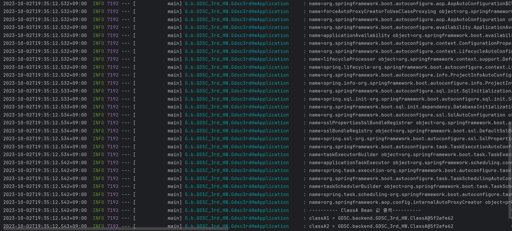
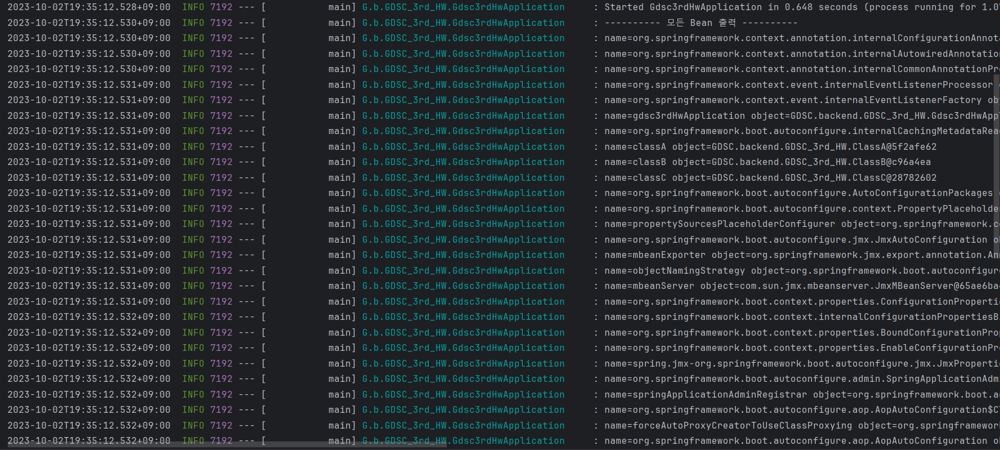

# 스프링

좋은 객체 지향 애플리케이션을 개발할 수 있게 도와주는 프레임워크

## 특징

1. 경량 컨테이너로 자바 객체를 직접 스프링 안에서 관리

    객체의 생성 및 소멸과 같은 생명 주기 (Life cycle)을 관리하며, 스프링 컨테이너에서 필요한 객체를 가져와 사용

2. 제어의 역전 (IOC : Inversion Of Control)

3. 의존성 주입 (DI : Dependency Injection)

# 스프링 빈

스프링 IoC 컨테이너에 의해 관리되는 자바 객체로 의존성 문제를 더 쉽게 해결

## 의존성

```java
public class A {
    private B b;

    public A(B b) {
        this.b = b;
    }
		...
}

public class B {
		...
}
```

A 클래스를 생성하기 위해선 B 클래스가 존재해야 하므로 A 클래스는 B 클래스에 대한 의존성을 가짐

## 스프링 IoC 컨테이너

빈을 관리하는 객체

## 싱글톤

애플리케이션이 시작될 때, 인스턴스를 메모리에 딱 하나 할당하고, 뒤의 호출 시마다 해당 인스턴스를 반환해 주는 디자인 패턴으로 이미 만들어진 객체를 공유해서 효율적인 사용이 가능

# 스프링 빈을 등록하는 방법

## @Bean

```java
public class Appconfig {
    @Bean
    public BeanA beanA() {
        return new BeanA();
    }

    @Bean
    public BeanB beanB() {
        return new BeanB(beanA());
    }

    @Bean
    public BeanC beanC() {
        return new BeanC(beanA());
    }
}
```

싱글톤이 아님

## @Configuration

```java
@Configuration
public class Appconfig {
    @Bean
    public BeanA beanA() {
        return new BeanA();
    }

    @Bean
    public BeanB beanB() {
        return new BeanB(beanA());
    }

    @Bean
    public BeanC beanC() {
        return new BeanC(beanA());
    }
}
```

싱글톤으로 관리

## Component Scan

스프링이 애플리케이션의 클래스를 검색하고, 자동으로 스프링 빈을 등록하는 방법

### @Component

```java
@Component
public class BeanA {
	...
}

@Component
public class BeanB {
	...
}

@Component
public class BeanC {
	...
}
```

* 스프링 빈으로 등록하려는 클래스에 붙일 수 있는 어노테이션

* 스프링은 이 어노테이션이 붙은 클래스를 자동으로 검색하고 빈으로 등록

* 스프링 빈은 기본적으로 싱글톤으로 관리

### @Component Scan

```java
@ComponentScan
public class AutoAppconfig {}
```

* 스프링이 어느 패키지에서 클래스 검색을 시작할지 및 검색할 패키지의 범위를 설정

* 기본적으로 @ComponentScan이 붙은 설정 정보 클래스의 패키지가 시작 위치가 됨

# 로그


