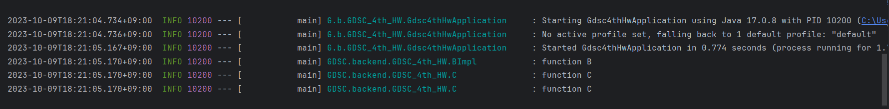

# 의존성 주입

DI (Dependency Injection) : 외부에서 두 객체 간의 관계를 결정해 주는 디자인 패턴으로, 인터페이스를 사이에 둬서 클래스 레벨에서는 의존관계가 고정되지 않도록 하고 런타임 시에 관계를 동적으로 주입하여 유연성을 확보하고 결합도를 낮출 수 있게 해줌

## 방법

### 생성자 주입

생성자를 통해 의존 관계를 주입하는 방법으로 객체의 최초 생성 시점에 스프링이 의존성을 주입하므로 주입받은 객체가 변하지 않거나, 반드시 객체의 주입이 필요한 경우에 강제하기 위해 사용할 수 있음

### 수정자 (setter) 주입

setter라 불리는 필드의 값을 변경하는 수정자 메서드를 통해서 의존관계를 주입하는 방법으로 선택, 변경 가능성이 있는 의존관계에 사용할 수 있음

### 필드 주입

필드에 바로 주입하는 방법으로 의존성이 프레임워크에 강하게 종속된다는 문제점이 있으므로 더 이상 추천되는 방법이 아님

### 일반 메서드 주입

한 번에 여러 필드를 주입받을 수 있지만 일반적으로 잘 안 씀

## Lombok

생성자 주입을 자동으로 설정

* @NoArgsConstructor : 파라미터가 없는 기본 생성자를 생성

* @RequiredArgsConstructor : final 또는 @NonNull로 표시된 필드만을 파라미터로 하는 생성자를 생성

* @AllArgsConstructor : 모든 필드 값을 파라미터로 받는 생성자를 생성

# 스프링 부트

스프링 기반의 애플리케이션을 빠르게 개발하고 실행하기 위한 프레임워크로 개발에 필요한 복잡한 설정을 스프링 부트가 대신 해줌

## 특징

1. WAS

    Tomcat 같은 웹 서버를 내장해서 별도의 웹 서버를 설치하지 않아도 됨

2. 라이브러리 관리

    손쉬운 빌드 구성을 위한 스타터 종속성 제공 및 라이브러리 버전 관리

3. 자동 구성

    * 프로젝트 시작에 필요한 스프링과 외부 라이브러리의 빈을 자동 등록

    * 스프링 애플리케이션에 공통으로 필요한 애플리케이션 기능을 자동으로 구성

4. 외부 설정

    환경에 따라 달라져야 하는 외부 설정 공통화

5. 프로덕션 준비

    모니터링을 위한 메트릭, 상태 확인 기능 제공

    * 스프링 애플리케이션 컨텍스트에 구성된 빈

    * 스프링 부트의 자동 구성으로 구성된 것
    
    * 애플리케이션에서 사용할 수 있는 환경 변수, 시스템 프로퍼티, 구성 프로퍼티, 명령줄 인자
    
    * 최근에 처리된 HTTP 요청 정보
    
    * 메모리 사용량, 가비지 컬렉션, 웹 요청, 데이터 소스 사용량 등 다양한 메트릭

# 로그

